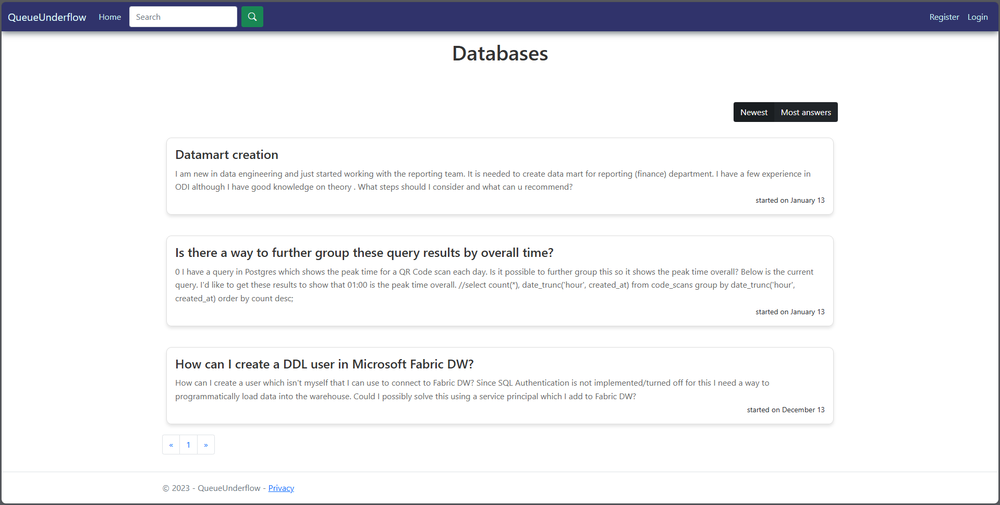

# .Net project QueueUnderflow
### QueueUnderflow Platform

The "QueueUnderflow" platform is designed to facilitate organized discussions across various topics, with features tailored for three user types: unregistered visitors, registered users, and administrators.

Unregistered visitors can view the platform's introduction page and access login and registration forms, while registered users have enhanced features, including profile creation and the ability to start new discussions or respond to existing ones. Topics are organized by categories, with each category displaying multiple discussions that can be paginated for easy navigation. Discussions and replies are sorted based on user-defined criteria, and a built-in search engine allows users to search through discussions and responses using keywords.

Registered users can edit their profiles, initiate new discussion topics, and modify or delete their own posts. Administrators oversee the platform's content, including removing inappropriate discussions and managing topic categories through full CRUD (Create, Read, Update, Delete) capabilities. They are also responsible for assigning and revoking user permissions to ensure content quality and organization.

This platform functions similarly to a SaaS application like Stack Overflow, where users can ask and answer questions within organized categories, maintain profiles, and rely on moderator and admin support to manage content and user privileges.

### Screenshots from the app

